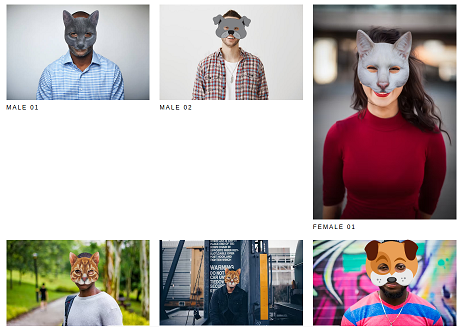

# gatsby-facejs-spooky-masks

Funny Masks, Facial Recognition - TensorFlowJS

> This demo shows off how to use [face-api.js](https://github.com/justadudewhohacks/face-api.js) to place spooky masks on photos using facial recognition and math!

```yml
node.js version: 14.21.2

TensorflowJS works well with Ubuntu 20.04, but ISSUE with win 10...
```

```bash
$ nvm use 14.21.2
$ npm install
$ npm start
```

Visit http://localhost:8000/




&copy; 2018 - 2022 @liyang51827

All Rights Reserved.
